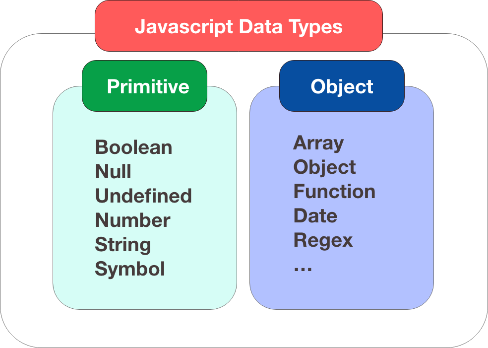

<div align="center">
  
  <h1> javaScript crash course by Pasacomputer </h1>
</div>

> สำหรับการเรียนในครั้งนี้จะต้องขอขอบคุณ Course ดีๆ จากโครงการของ KBTG และอาจารย์ผู้สอน อาจารย์วรายุทธ เลิศกัลยาณวัตร จากเพจ PasaComputer เป็นอย่างสูงนะครับ ที่สอนในโครงการนี้
>> [Link สำหรับเข้าเรียน กดที่นี่ ได้เลยนะครับ!!](https://www.youtube.com/watch?v=Tz5Wk1yPlBE&feature=youtu.be)

## Table of contains

- [Table of contains](#table-of-contains)
  - [Inrtro javaScript](#inrtro-javascript)
  - [Variables](#variables)
  - [Data Types](#data-types)
  - [Arithmetic Operator](#arithmetic-operator)
  - [Conditions](#conditions)
  - [Functioins](#functioins)
  - [Flow control](#flow-control)
  - [DOM Manipulate](#dom-manipulate)
  - [Event](#event)
  - [CSS](#css)

### Inrtro javaScript

ภาษา javaScript เป็นภาษาโปรแกรมเชิงวัตถุแบบ Dynamic Type ซึ่งการ Run ภาษา javaScript นั้นจะถูก Run ผ่าน Engine ที่เราคุ้นเคยกันเป็นอย่างดีอยู่แล้ว เช่น Google chrome, Firefox, Microsoft Edge เป็นต้น

> Note : Dynamic Type คือโปรแกรมจะไม่ทำการตรวจสอบ Type ก่อนการ Run-time (Interperted) นั้นเอง ข้อดีของการเขียนโปรแกรมแบบ Dynamic Type คือเราไม่ต้อง Declare valueให้กับตัวแปร(Variables) ที่ไม่จำเป็นก่อน และเราสามารถเปลี่ยนแปลงค่าได้ภายหลังได้อีกด้วย

ซึ่งในปัจจุบันภาษา javaScript ได้รับความนิยมเป็นอย่างมากในการพัฒนา Web application และยังมี Framework, Libraly จำนวนมากที่ถูกสร้างมาจากภาษา javaScript ยกตัวอย่างเช่น ReactJS, Angular, VueJS เป็นต้น

### Variables

ในภาษา javaScript จะมีการแบ่ง Variables ออกเป็นทั้งหมด 3 ชนิด ดังต่อไปนี้

- var ตัวแปรแบบ Global variable

- let ตัวแปร ที่สามารถเปลี่ยนแปลงค่าได้ตาม Block scope

- const ตัวแปรคงที่ ที่ไม่สามารถเปลี่ยนแปลงค่าได้

### Data Types

ภาษา javaScript จะถูกแบ่ง Data type ออกเป็นสิ่งต่างๆ ดังนี้

1. String มีค่าเป็นตัวอักษร โดยจะใช้ 'string ที่เราต้องการ' หรือว่า "string ที่เราต้องการ"
2. Number ค่าที่เรา assignment สามารถเติมตัวได้เลย เช่น 1 2 3 4 .. N
3. Boolean จะมีค่าเป็น True, False
4. Undefined จะเป็นค่าของตัวแปรที่ไม่ถูก Assign ค่าลงไป
5. Null เป็นค่าว่างที่เรา Assign ค่าลงไปโดยตรง
6. Object
7. Symbols เป็นสัญญาลักษณ์



### Arithmetic Operator

ตัวดำเนินการทางคณิตศาสตร์ เป็นตัวดำเนินการที่เราเอาไว้ บวก ลบ คูณ หาร หรือว่า ยกกำลัง โดยตัวดำเนินการทางคณิศาสตร์นั้น จะมีลำดับความสำคัญในการ บวก ลบ คูณ หาร หรือว่า ยกกำลัง ซึ่งเราควรใส่ วงเล็บ เพื่อเป็นการย้ำความสำคัญของการคำนวณด้วย โดยตัวดำเนินการทางคณิตศาสตร์ จะประกอบไปด้วย สัญญาลักษณ์ ดังต่อไปนี้

| ตำเนินการทางคณิตศาสตร์(Operator) | ความหมาย | ตัวอย่าง | ผลลัพธ์ |
| ---------------------------- | -------- | ------ | ----- |
| +                            | บวก      | 6+3    | 9     |
| -                            | ลูบ       | 6-3    | 3     |
| \*                           | คูณ       | 6\*3   | 18    |
| /                            | หาร      | 6/3    | 2     |

### Conditions

เป็นการเปรียบค่าว่ามีค่าถูกต้องตามที่ต้องการหรือไม่ โดยจะมีค่าเป็น Boolean (True, false) หรือว่าเป็นการเปรียบเทียบค่าว่า ถ้าหากเงื่อนไขเป็นจริง เราต้องการให้โปรแกรมของเราเป็นอย่างไร แล้วถ้าเงื่อนไขเป็นเท็จ เราต้องการให้โปรแกรมทำงานอย่างไร

_Example_

```js
function searchPhotos(event) {
  const keyword = event.target.value;

  if (event.key === "Enter" && keyword) {
    for (let i = 1; i <= 9; i++) {
      appendImageELem(keyword, i);
    }
  }
}
```

### Functioins

สำหรับการเขียนโปรแกรมนั้น ถ้าหากเราไม่มี function เราจะต้องเขียนโปรแกรมแบบเดิม เพื่อให้โปรแกรมทำงานแบบเดิม ซึ่งจะทำให้เราเสียเวลาเป็นอย่างมาก และสิ้นเปลืองทรัพยากรโดยใช้เหตุ ดังนั้นเราจึงสร้าง Function ขึ้นมาเพื่อลดขั้นตอนนั้นลงไป ยกตัวอย่างเช่น ถ้าหากเราจะต้องคำนวณ อายุ ของคน เราจะต้องเขียน function ที่จะต้องคำนวณอายุใช่ไหมครับ

_Example_

```js
// function yearOld
let JohnBith = 2000;
let currentYear = 2020;

function yearOld() {
  let year = currentYear - JohnBirth;
  console.log(year);
}

yearOld();
```

### Flow control

ในการเขียนโปรแกรมจะมีขั้นตอนหนึ่งที่เรียกว่า การวนซ้ำ เพื่อเป็นการลดขั้นตอนการทำงานแบบเดิมออก โดยในที่นี่เราเรียกว่า Loop โดย Loop จะถูกแบ่งออกเป็นแต่ละประเภทดังต่อไปนี้ คือ

1. for loop เป็นการสั่งให้โปรแกรมวนซ้ำเมื่อเงื่อนไข เป็นจริง และจะหยุดเมื่อเงื่อนไขเป็นเท็จ และเราสามารถกำหนดจำนวนรอบให้กับการวนซ้ำได้
2. While loop เป็นการเขียนโปรแกรมเพื่อให้โปรแกรมทำซ้ำไปเรื่อยๆ เมื่อเงื่อนไขยังคงมีค่าเป็นจริงอยู่ และจะหยุดทำซ้ำเมื่อเงื่อนไขเป็นเท็จ
3. Do-while-loop
   เป็นการเขียนโปรแกรมเพื่อให้โปรแกรมทำซ้ำไปเรื่อยๆ เมื่องเงื่อนไขยังคงมีค่าเป็นจริงอยู่ และจะหยุดทำซ้ำเมื่อเงื่อนไขเป็นเท็จ แต่จะมีข้อแตกต่างตรงที่ โปรแกรมจะทำการ Run ก่อนที่จะตรวจสอบเงื่อนไข อย่างน้อย 1 ครั้งนั้นเอง

### DOM Manipulate

// DOM manipulations

```js
// การดึงค่าหรือว่าอ่าน่าของข้อมูล เช่น Element หรือว่า  Property ต่างๆ มาแสดงผล
document.querySelector("input");

// การดึงค่าหรือว่าอ่าน่าของข้อมูล ด้วย ID
document.getElementById("email");

// สร้าง Elemnt ใหม่ตามที่เราต้องการ
document.createElement("div");

// 1.หลังจากที่เราสร้าง Element ขึ้นมาแล้ว
// 2.หากเราต้องการสร้าง Element ลูกของ Element ก่อนหน้า เราจะต้องใช้คำสั่งนี
document, appendChild(Element);
```

### Event

Event คือสิ่งที่เราต้องการให้เกิดอะไรขึ้นเมื่อผู้ใช้งาน Click ปุ่ม button ที่เราสร้างขึ้นมา โดยจะมีตัวที่ถูกเรียกใช้งานประมาณนี้

```js
// Event
// 1.เป็นการเรียกใช้งานของปุ่มนี้
const btnElem = documment.querySelector("button");

// 2.จากนั้นเมื่อไหร่ก็ตามที่มีกดปุ่มนี้ เราต้องการทำให้มันเกิดอะไรขึ้น นั้นเอง
// 3.และหลังจากนั้นให้เรียกใช้ function onClik เพื่อทำงาน ตามที่เราต้องการ
btnElem.addEventListener("click", onClick);

// function
// event.target คือ Element ที่ทำให้เกิด Event ในที่นี่คือ button นั้นเอง
function onClick(event) {
  console.log(event.target);
}
```

### CSS

- CSS universal selectors select any type of elements in an HTML page
- What is rem ?

```css
body {
  margin: 0;
  text-align: center;
  padding: 2rem 15rem;
  /* top, bottom nd left, rignt*/
}
```

อธิบาย Code ในส่วนของ padding


key:value // คำสั่งนี้ใช้ในการ Clear value ของ Browser ที่เป็นนสีดำเมื่อเรา เอาเมาส์ไปชี้หรือว่าคลิกออก

```css
input:focus {
  outline: none;
}
```
